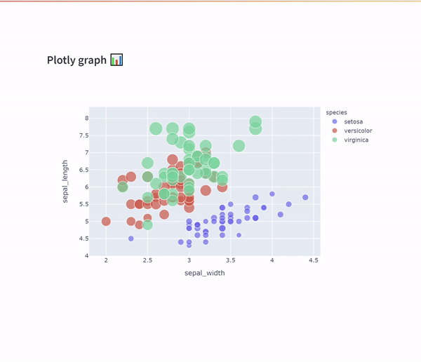

# 👉 Interactive plotly data selection in streamlit 📊

<p align="center"></p>

[](https://interactive-plotly-dataframe.streamlit.app/)

### streamlit-interactive-plotly-data
This workaround enables you to select data interactively from plotly graphs in streamlit in a similar fashion to how you can do [interactive graphing with dash](https://dash.plotly.com/interactive-graphing). Most of this is achieved with the excellent [streamlit-plotly-events](https://pypi.org/project/streamlit-plotly-events/) library which allows you to pull up the plotly event data from a given plot. 

This demo app demonstrates a function [`selected_indexes`](interactive_plotly_streamlit_app.py#L10) which can be used to link the selected data back to dataframe used to generate the plot. Returning the dataframe indexes to easily filter on the selected data.

### 🔥 Bonus
If using VScode, check out the `.vscode/launch.json` which can be used to run debugging on live streamlit apps in development.


### 🐍 Requirements
```
pip install plotly streamlit streamlit-plotly-events
```
